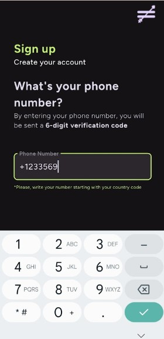

# Uncommon Ground

## Description

Uncommon Ground is the perfect application fighting with the current polarisation problem in our society in fun and light-hearted way. This app is not your usual dating app, is the app where you meet someone soley based on their porfile description and don't see their profile picture until day 5. Until this time you are presented each day with an Ice breaker to open a new and interesting conversation. Do you eat your pizza with pineapple? Let's find out!

### Features

- **AI-Powered Face Recognition:** Uses an AI model to identify you in the imported images for security reasons
- **Safe Camera Access:** Securely uses device camera for scanning and checking your face
- **Phone Number Authentication:** User can securely log in the app with a phone number and OTP Verification
- **User-Friendly Interface:** Simple and intuitive design for a smooth user experience.
- **GPS current location:** Set the preferred maximum distance to meet your potential matches
### Tech Stack

- **Framework:** Flutter (Dart)
- **AI integration:** Face-Verify Plugin
- **Firebase Database:** Firebase
- **Firebase Authentication:** Firebase Authentication
- **GPS:** Google maps location plugin


## Screenshots




## Prerequisites
- **Flutter Installation:** Ensure Flutter is installed by following the instructions: https://docs.flutter.dev/get-started/install

## Run Locally

Make sure Flutter is installed by following the directions here:
https://docs.flutter.dev/get-started/install

Clone the project

```bash
  git clone https://git.fhict.nl/I523712/blind-dating.git
```

Navigate to directory

```bash
  cd uncommon_grounds
```

Connect to a physical device or Android/IOS emulator by following these directions:

- Android: https://docs.flutter.dev/get-started/install/windows/mobile#configure-android-development
- IOS: https://docs.flutter.dev/get-started/install/macos/mobile-ios#configure-ios-development

Start the server

```bash
  flutter run
```

## Common issues

Below are some common errors and how to resolve them:

#### 1. APK Installation Failure

**Error:**

```bash
C:<projectc-directory>\blind-dating\uncommon_grounds\build\app\outputs\flutter-apk\app-debug.apk:
```

- **Cause:** This error indicates that a previous installation of your app is already present on your device, and it was signed with a different certificate than your current build. In Android, updating an app requires the signatures to match.
- **Solution:** Uninstall the existing app by using the command line or manually.

#### 2. Device Not Found

**Error:**

```bash
No connected devices.
```

- **Cause:** Flutter cannot detect a connected physical device or emulator.
- **Solution:** Ensure the device is connected and USB debugging is enabled. If using an emulator, ensure it is running. Run ` flutter devices` to confirm connected devices.

#### 3. Flutter SDK Not Found

**Error:**

```bash
Flutter SDK not found.
```

- **Cause:** Flutter environment variables are not set up correctly.
- **Solution:** Confirm Flutter is installed and added to your system’s PATH. Run `flutter doctor` and follow any suggested fixes.

#### 4. Camera Access Denied

**Error:** Camera does not open or shows a black screen.

- **Cause:** The app lacks proper permissions for camera access.
- **Solution:** Grant camera access manually from device settings.

#### 5. Location Services Denied


## Acknowledgements

- [README editor](https://readme.so/editor)
- [Face Verifify Plugin GitHub](https://github.com/Badieh/face_verify/tree/main)
- [Face Verify Plugin on pub.dev](https://pub.dev/packages/face_verify)
- [Flutter Camera Access Documentation](https://docs.flutter.dev/cookbook/plugins/picture-using-camera)
- [Firebase Authentication Documentation](https://firebase.google.com/docs/auth/flutter/phone-auth)
- [Google Maps Plugin on pub.dev](https://pub.dev/packages/google_maps_flutter)
- [Firebase Authentication Plugin on pub.dev](https://pub.dev/packages/firebase_auth)